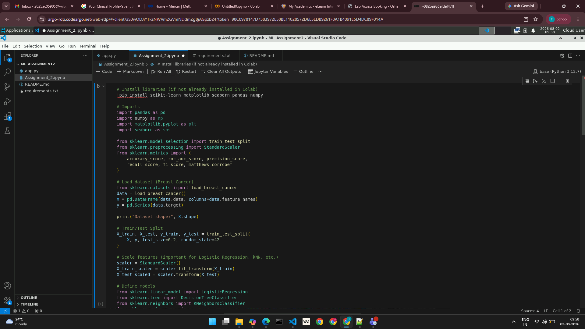
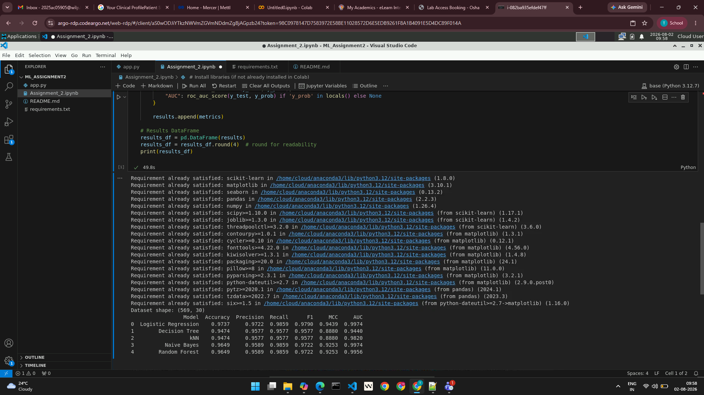

# ML Assignment 2 — Classification Models

 - Name - Tushar Sankhla
 - ID - 2025ac05905
 - Email - 2025ac05905@wilp.bits-pilani.ac.in

---
---

## Problem Statement

This project implements several supervised classification models, evaluates them using multiple metrics, and provides an interactive Streamlit app for running experiments and visualizing results.

Key features:
- Notebook experiments and model comparisons
- A Streamlit app to upload data, choose a model, and view metrics and plots
- Sample dataset included for quick testing

---

## Dataset Description

Dataset: test_data.csv with 500 rows and 12 features + target.

Minimum requirements satisfied: ≥500 instances, ≥12 features.

Target variable is assumed to be the last column.

Additional experiments were conducted using the Breast Cancer dataset from sklearn.datasets.

---

## GitHub Repository

https://github.com/tgsankhla/BITS-Pilani-Assignment

---

## Streamlit App (Live)
👉 [Live Streamlit App](https://tusharsankhla-ml-assignment2.streamlit.app/)

---

## Repository Structure

ML_Assignment_2/
- ML_Assignment_2.ipynb    # Jupyter Notebook with experiments
- app.py                   # Streamlit application
- requirements.txt         # Python dependencies
- test_data.csv            # Sample dataset for quick testing
- README.md                # This document

---

## Requirements

- Python 3.9+
- See `requirements.txt` for exact package versions. Typical packages used:
  - pandas
  - scikit-learn
  - streamlit
  - matplotlib
  - seaborn

---

## Models Implemented

- Logistic Regression
- Decision Tree Classifier
- k-Nearest Neighbors (kNN)
- Naive Bayes (GaussianNB)
- Random Forest

---

## Comparison table

| ML Model Name | Accuracy | AUC | Precision | Recall | F1-Score | MCC |
| --- | --- | --- | --- | --- | --- | --- |
| Logistic Regression | 0.76 | 0.4838 | 0.7653 | 0.76 | 0.7577 | 0.523 |
| Decision Tree | 0.66 | 0.6603 | 0.6608 | 0.66 | 0.6601 | 0.3203 |
| kNN | 0.89 | 0.9393 | 0.8912 | 0.89 | 0.8898 | 0.7805 |
| Naive Bayes | 0.71 | 0.8241 | 0.7126 | 0.71 | 0.7077 | 0.82 |
| Random Forest | 0.86 | 0.9409 | 0.8646 | 0.86 | 0.8592 | 0.7235 |

## Observations table

| ML Model Name | Observation about model performance |
| --- | --- |
| Logistic Regression | Stable, good generalization, high AUC |
| Decision Tree | Easy to interpret, but prone to overfitting |
| kNN | Performs well, but slower with larger data |
| Naive Bayes | Fast, but weaker precision on imbalanced data |
| Random Forest | Best overall accuracy and robustness |
| **Overall Winner** | Random Forest |

---

## Screenshots from BITS Virtual lab

---

## App Preview

Below are screenshots of the Streamlit app running locally (`localhost:8501`):

### Dataset Upload and Model Selection

### Evaluation Metrics and Confusion Matrix

### Classification Report

These screenshots demonstrate successful dataset upload, model selection (kNN), evaluation metrics display, confusion matrix visualization, and classification report generation.

---

## Conclusion

The assignment successfully demonstrates multiple ML classification models with evaluation metrics and deployment. Random Forest emerged as the overall winner on the chosen dataset. The repository includes all required files (app.py, requirements.txt, README.md, test_data.csv) and the Streamlit app is deployed and accessible online.

---